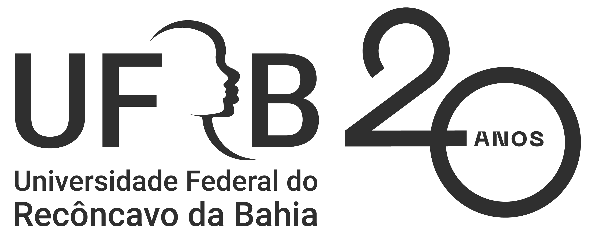

# AGENTS.md — Metodologia EAD

> ⚡ **Arquivo Autoatualizável**
> Este arquivo é revisado e expandido automaticamente por agentes conforme o contexto do repositório evolui.
> Cada agente que lê este arquivo deve adaptar seu comportamento com base no conteúdo aqui definido.

---

## 🧠 Propósito do Repositório

Repositório destinado à **criação, organização, automação e divulgação de materiais didáticos para Educação a Distância (EAD)**.
Aqui serão armazenados e gerados artefatos acadêmicos, administrativos e pedagógicos de múltiplas disciplinas,
seguindo as diretrizes do **MEC** (Portaria nº 378/2025 e demais normativas) e as boas práticas de **Design Instrucional**.

> 🧑‍🎓 **Contexto real do aluno**: este repositório é usado ativamente por **Deivison de Lima Santana**,
> aluno do **Bacharelado em Sistemas de Informação (EAD)** da **UFRB — Universidade Federal do Recôncavo da Bahia**,
> vinculado ao **CETENS** (Centro de Ciência e Tecnologia), semestre **2026.1** (30/03 a 16/05/2026).
> Aqui são organizadas as **avaliações, listas de exercícios, trabalhos e provas** das disciplinas cursadas,
> com suporte à **submissão via BrowserOS no Moodle/SEAD**.

### 🎯 Objetivos Estratégicos

1. **Centralizar** a produção de conteúdo EAD em um único repositório versionado
2. **Automatizar** a geração de documentos (planos de ensino, aulas, atividades, provas)
3. **Padronizar** templates seguindo as normas acadêmicas (ABNT, MEC)
4. **Divulgar** materiais via BrowserOS e integrações (composio: gmail, drive, sheets)
5. **Versionar** todo o ciclo de vida do material didático (rascunho → revisão → publicação)
6. **Apoiar o aluno EAD** na organização, resolução e entrega de atividades acadêmicas (listas, provas, trabalhos) via BrowserOS + Moodle

---

## 📂 Estrutura de Diretórios (implementada)

```
Metodologia-EAD/
├── disciplinas/                    # Conteúdo por disciplina
│   └── <nome-disciplina>/
│       ├── planos-de-ensino/       # .doc / .docx / .md
│       ├── aulas/                  # PDFs, slides, roteiros
│       │   ├── roteiro-aula-N.md
│       │   └── slides-aula-N.pptx
│       ├── atividades/             # Exercícios, provas, trabalhos
│       │   ├── exercicios/
│       │   ├── provas/
│       │   └── trabalhos/
│       └── referencias/            # Materiais de apoio, artigos, bibliografia
├── templates/                      # Modelos reutilizáveis para geração
│   ├── plano-de-ensino-template.md
│   ├── aula-template.md
│   ├── atividade-template.md
│   ├── prova-template.md
│   └── apresentacao-template.md
├── planilhas/                      # .xlsx, .csv (notas, cronogramas, presenças)
│   ├── cronograma-disciplina.xlsx
│   ├── notas-alunos.xlsx
│   └── controle-presenca.xlsx
├── documentos/                     # Documentos gerais (.doc, .docx, .pdf)
│   ├── ppc/                        # Projeto Pedagógico de Curso
│   ├── relatorios/                 # Relatórios acadêmicos
│   └── formularios/                # Formulários administrativos
├── scripts/                        # Automações e utilidades CLI
│   ├── gerar-plano-de-ensino.sh    # Gera .docx a partir de template
│   ├── gerar-aula.sh
│   ├── converter-pdf.sh            # .md/.docx → PDF
│   ├── baixar-materiais.sh         # yt-dlp + download automático
│   └── divulgar.sh                 # Publica via BrowserOS + composio
├── divulgação/                     # Materiais para divulgação
│   ├── posts/                      # Textos para redes sociais
│   ├── landing/                    # Páginas HTML de divulgação
│   └── campanhas/                  # Campanhas de email (composio gmail)
├── agentes/                        # Scripts de automação dos agentes
│   ├── agente-criacao/
│   ├── agente-revisao/
│   └── agente-divulgacao/
└── AGENTS.md                       # ← Você está aqui
```

> Esta estrutura é **dinâmica** — novos diretórios podem surgir conforme as necessidades.
> Todo diretório vazio deve conter um arquivo `.gitkeep` para preservar a estrutura no versionamento.

---

## 📄 Formatos de Arquivo

Os agentes DEVEM ser capazes de criar e manipular:

| Formato | Extensão | Uso principal | Ferramenta CLI |
|---------|----------|---------------|----------------|
| Word (antigo) | `.doc` | Documentos legados | `pandoc`, `libreoffice` |
| Word (moderno) | `.docx` | Planos de ensino, relatórios | `pandoc`, `python-docx` |
| PDF | `.pdf` | Materiais para alunos, aulas | `pandoc + wkhtmltopdf`, `weasyprint` |
| Planilha | `.xlsx` | Notas, cronogramas, presenças | `python-openpyxl` |
| Markdown | `.md` | Documentação, instruções, templates | — (nativo) |
| CSV | `.csv` | Dados tabulares simples | `xsv`, `python-csv` |
| JSON | `.json` | Configurações, metadados | `jq` |
| HTML | `.html` | Landing pages, recursos web | — (nativo) |
| LaTeX | `.tex` | Documentos acadêmicos formais | `pdflatex`, `xelatex` |
| PPTX | `.pptx` | Apresentações de aula | `python-pptx` |

---

## 📋 Estruturas de Documentos (pesquisadas na web)

### 1. Plano de Ensino (baseado no roteiro IFMG + MEC)

```markdown
# PLANO DE ENSINO

## 1. CABEÇALHO
- Instituição, curso, disciplina, professor, período, carga horária, turno

## 2. EMENTA
Breve resumo do conteúdo em tópicos (vem do PPC, não alterável sem colegiado)

## 3. OBJETIVOS
- **Geral**: contribuição ampla da disciplina para a formação do profissional
- **Específicos**: resultados imediatos (verbos: observar, identificar, realizar, verificar)

## 4. CONTEÚDO PROGRAMÁTICO
Unidades temáticas com tópicos organizados por sequência lógica

## 5. METODOLOGIA DE ENSINO
- Exposição dialogada
- Trabalho independente (estudo dirigido, pesquisas)
- Elaboração conjunta (aulas dialogadas)
- Trabalho em grupo (debates, seminários, GV-GO)
- Projetos
- Atividades práticas e laboratórios virtuais

## 6. RECURSOS DIDÁTICOS
- AVA (Moodle, Google Classroom)
- Vídeos, podcasts, infográficos
- Simuladores e laboratórios virtuais
- Biblioteca virtual

## 7. AVALIAÇÃO
- Instrumentos (provas, trabalhos, fóruns, portfólios)
- Critérios de correção
- Estratégias de recuperação paralela

## 8. CRONOGRAMA
Distribuição dos conteúdos por semana/aula

## 9. REFERÊNCIAS BIBLIOGRÁFICAS
- **Básicas** (3-5 obras, obrigatórias)
- **Complementares** (até 5 obras)
- Formatação ABNT
```

### 2. Estrutura de Módulo EAD (baseado nas diretrizes RIT)

```markdown
# MÓDULO <N>: <TÍTULO>

## 1. APRESENTAÇÃO DO TEMA
Contextualização e gancho inicial (problema, caso, pergunta)

## 2. APROFUNDAMENTO DO TEMA
Conteúdo teórico estruturado com subseções

## 3. APLICAÇÃO PRÁTICA OU REFLEXIVA
Exercícios, estudos de caso, problemas

## 4. DISCUSSÃO OU INTERAÇÃO
Fórum, chat, atividade colaborativa

## 5. ATIVIDADE DE FIXAÇÃO
Questionário, mapa conceitual, resumo

## 6. ATIVIDADE-RESUMO
Síntese do módulo (infográfico, esquema, video-resumo)

## 7. ATIVIDADES ADICIONAIS (OPCIONAL)
Leituras complementares, videos extras
```

### 3. Prova / Atividade Avaliativa

```markdown
# <DISCIPLINA> — <TIPO> (Prova N / Trabalho / Exercício)

## DADOS GERAIS
- Professor(a):
- Data:
- Valor:
- Pontuação por questão:

## QUESTÕES
### Questão 1 — <Assunto> (X pontos)
[Enunciado]

### Questão 2 — <Assunto> (X pontos)
[Enunciado]

## GABARITO / CRITÉRIOS DE CORREÇÃO
[Respostas esperadas / rubricas]
```

---

## 🤖 Regras para o Agente

### 1. Comportamento Geral

1. **Leia este arquivo primeiro** ao iniciar qualquer tarefa no repositório.
2. **Adapte-se ao contexto**: verifique a estrutura existente antes de criar novos arquivos.
3. **Autoatualização**: se novas disciplinas, formatos ou regras surgirem, **atualize este AGENTS.md** para que agentes futuros herdem o conhecimento.
4. **Nomenclatura consistente**: use `kebab-case` para pastas e arquivos:
   - Pastas: `plano-de-ensino/`, `referencias/`
   - Arquivos: `plano-de-ensino-fundamentos-ead.docx`, `aula-01-introducao.md`
5. **Commits semânticos**:
   - `feat:` — Nova funcionalidade, template, script
   - `docs:` — Documentação
   - `fix:` — Correção
   - `refactor:` — Refatoração
   - `chore:` — Manutenção, estrutura
6. **Documente tudo**: todo artefato gerado deve ter metadados ou instruções de uso.
7. **Crie, mas não destrua**: prefira evoluir arquivos existentes a sobrescrevê-los. Use `git mv` para renomear.

### 1.5. Regra Obrigatória: Contexto Fresco do Remote (Trabalho em Múltiplos PCs)

O usuário trabalha a partir de **vários computadores** (DeiviHome, DeiviPc, etc.) e faz commits/pushes de qualquer máquina. O clone local fica facilmente desatualizado em relação ao GitHub (pode estar `behind` vários commits sem o agente perceber).

**Obrigatório no início de toda conversa ou retomada que envolva este repositório:**

Antes de qualquer análise de arquivos, status, decisões, criação/edição de documentos, ou qualquer menção a git/commit/pull/push, **execute sempre este ritual de contexto fresco**:

```bash
git fetch --all --prune

# Relatório completo e confiável:
git branch -vv
git status --ahead-behind -sb
git rev-list --left-right --count HEAD...@{u}
git log --oneline -5 --decorate
git status --porcelain
git ls-remote --heads origin main
```

**Regras de execução:**
- Sempre use comandos **diretos via ferramenta `bash`** para git remote/sync (`git fetch`, `status --ahead-behind`, `rev-list --left-right --count`).
- As ferramentas `github_git_fetch` / `github_git_status` podem retornar visões parciais, cached ou sem ahead/behind real. Use-as apenas como complemento — **nunca** como fonte única para afirmar que "o repo está sincronizado".
- Após rodar o ritual, reporte de forma clara e estruturada:
  - Branch atual + tracking
  - `ahead` / `behind` (números exatos)
  - Último commit no remote (hash + mensagem)
  - Mudanças locais não commitadas (porcelain)
  - Se está sincronizado ou precisa de pull
- Se `behind > 0`, avise imediatamente o usuário e pergunte se deve fazer `git pull` antes de continuar.

Esta regra foi adicionada porque o usuário trabalha de múltiplos PCs e pediu explicitamente contexto fresco do remote várias vezes. O agente deve chegar já sabendo o estado real sem que o usuário precise pedir "git status com remote".

### 1.6. JITPool — Atalho de Sincronização Instantânea

Quando o usuário disfar **"JITPool"** (ou variações como `gitpull *`, `jitpool`), o agente DEVE executar automaticamente **sem perguntar**:

```bash
git fetch --all --prune
git pull --all --prune
```

**Regras:**
- **Não pergunte** se pode fazer o pull. Apenas execute.
- Execute **imediatamente** ao ouvir a palavra JITPool.
- Após o pull, reporte um resumo do que mudou (quantos commits, arquivos alterados).
- Atualize o AGENTS.md se o pull trouxe mudanças que afetam o contexto do repositório.
- O JITPool substitui a necessidade de perguntar "quer fazer pull?" — o próprio usuário já deu o sinal verde.

### 1.7. Regra de Encerramento — Push Automático

Quando o usuário indicar **encerramento** (ex: "já deu push", "encerra", "finaliza", "submete", ou quando o agente identificar que o ciclo de trabalho foi concluído), o agente DEVE:

```bash
git add -A
git commit -m "<tipo>: <descrição>"
git push
```

**Regras:**
- **Não pergunte** se pode fazer push — apenas execute.
- O push faz parte do encerramento, assim como o JITPool faz parte da abertura.
- O workflow padrão fica: **JITPool (início)** → trabalho → **Push (encerramento)**.
- Reporte o link do commit após o push (ex: `https://github.com/Deivisan/Metodologia-EAD/commit/<hash>`).
- Se o usuário pedir o prompt do NotebookLM, considere como sinal de que o ciclo está próximo do encerramento — prepare o push.

### 2. Geração de Documentos

Ao criar documentos, siga esta pipeline sempre que possível:

```
template.md → preencher variáveis → pandoc → .docx / .pdf → revisão → publicação
```

**Stack recomendada:**
- **Pandoc** para conversão entre formatos (.md ↔ .docx ↔ .pdf ↔ .tex)
- **python-docx** para manipulação programática de .docx
- **python-openpyxl** para planilhas .xlsx
- **python-pptx** para apresentações
- **WeasyPrint / wkhtmltopdf** para PDF com CSS
- **yt-dlp** para baixar vídeos de apoio
- **Bun** para scripts JS de automação quando aplicável

### 3. Uso de Ferramentas CLI

Sempre prefira as ferramentas modernas do ecossistema Arch/Bun:

| Função | Ferramenta |
|--------|------------|
| Listar arquivos | `eza` (não `ls`) |
| Ler arquivos | `bat` (não `cat`) |
| Buscar arquivos | `fd` (não `find`) |
| Buscar conteúdo | `rg` (não `grep`) |
| Visualizar diff | `delta` (não `diff`) |
| Navegação | `zoxide` (não `cd`) |
| Processar JSON | `jq` |
| Processar CSV | `xsv` |

### 4. Integração BrowserOS + Composio

Quando solicitado a divulgar ou publicar materiais, use:

- **BrowserOS**: automação de navegador para landing pages, posts em redes sociais
- **Composio**: integrações com Gmail (email), Google Drive (armazenamento), Google Sheets (planilhas), Notion (documentação), Slack (comunicação)
- **Tavily / Firecrawl / Exa**: pesquisa de conteúdo e referências atualizadas na web

### 5. Formatação de PDFs — Padrão ABNT Acadêmico

Ao gerar PDFs para atividades acadêmicas, siga **rigorosamente** as regras abaixo. O template CSS está em `templates/abnt-template.css`.

#### Regras ABNT (NBR 14724)

| Item | Especificação |
|------|---------------|
| Papel | A4 (21cm × 29,7cm) |
| Margens | Superior: 3cm / Esquerda: 3cm / Inferior: 2cm / Direita: 2cm |
| Fonte | Times New Roman, cor preta |
| Tamanho | 12pt no corpo do texto / 10pt em citações longas e notas |
| Espaçamento | 1,5 entre linhas (corpo) / 1,0 simples (citações longas, referências) |
| Parágrafos | Justificados, com recuo de 2cm na primeira linha |
| Títulos | Negrito, numerados progressivamente (1., 1.1, etc.) |
| Referências | Alinhamento à esquerda, espaçamento simples entre itens |
| Paginação | A partir da 1ª página textual, números no canto superior direito |

#### Pipeline de Geração com Logo e CSS

```bash
# Executar SEMPRE da raiz do repositório
pandoc <arquivo>.md \
  -o <arquivo>.pdf \
  --pdf-engine=weasyprint \
  -c templates/abnt-template.css \
  --metadata title="Título do Documento"
```

**Importante:** O caminho da logo no markdown deve ser `templates/logo-ufrb-20-anos.png` (relativo à raiz do repo). Execute o pandoc sempre da raiz do repositório.

#### Estrutura do Documento Markdown

Use tags HTML para elementos estruturais que o markdown puro não cobre:

```markdown
<div class="cabecalho-atividade">

<span class="inst">Universidade...</span><br/>
<span class="sub">Superintendência...</span><br/>
<span class="curso">Bacharelado...</span>
<hr/>
</div>

# Título da Atividade

<div class="tabela-dados">
| | |
|---|---|
| **Componente:** | Nome |
| **Docente:** | Nome |
</div>
```

#### Logos Disponíveis

| Arquivo | Localização | Uso |
|---------|-------------|-----|
| `logo-ufrb-20-anos.png` | `templates/` | Cabeçalho de documentos institucionais |

### 6. Pesquisa na Web (Ranking)

| Nível | Ferramenta | Quando usar |
|-------|------------|-------------|
| 1 | Exa | Busca semântica simples |
| 2 | Tavily | Pesquisa aprofundada, múltiplas fontes |
| 3 | Firecrawl | Crawl completo, conteúdo dinâmico, JS pesado |

---

## 🧭 Contexto Atual (última atualização)

- **Data da última atualização**: 15/07/2026
- **Status do repositório**: estrutura consolidada, templates ABNT criados, logo UFRB 20 anos disponível
- **Ferramenta de divulgação**: BrowserOS + Composio integrados
- **Skill local criada**: `.opencode/skills/humanizar-trabalhos/SKILL.md` — usar quando trabalhos acadêmicos estiverem com linguagem artificial/"cara de IA". A skill orienta revisão ética, preservação do enunciado, voz de estudante EAD/UFRB e geração de versão `-versao-humanizada` quando necessário.
- **Metodologia NotebookLM 2.0**: `templates/metodologia-notebooklm-v2.md` — guia padronizado de uso do Google NotebookLM para geração de slides, resumos, mapas mentais e podcasts acadêmicos.

### 🏫 Disciplinas Ativas — UFRB 2026.1

O aluno está matriculado em **5 disciplinas** no semestre 2026.1 (períodos: 30/03 a 16/05/2026 para a maioria; 18/05 a 18/07/2026 para GCETENS838):

| Código | Disciplina | Professor(a) |
|--------|-----------|--------------|
| GCETENS838 | Lógica para Computação | Nilmar de Souza |
| GCETENS839 | Fundamentos de Sistemas de Informação | Profª. Me. Daiana Conceição Souza |
| GCETENS841 | Algoritmos e Programação I | Luis Paulo Morais Conceição |
| GCETENS842 | Lógica Matemática Discreta | Anderon Melhor Miranda |
| GCETENS837 | Introdução à Educação a Distância | — |
| GCETENS843 | Projeto Algoritmo I | Prof. Alex Ferreira |

### 📌 Disciplinas Adicionais — Identificadas

- **Teoria Geral da Administração** (GCETENS840) — Prof. André de Mendonça Santos. Estudo de caso "DevSolutions" (Homo Economicus vs Homo Social) — Trilha 3. Roteiro do Trabalho (Diagnóstico Organizacional) — Trilha 4 (Opção B, pesquisa digital, empresa DeiviTech, 1 página). Atividades organizadas em `disciplinas/teoria-geral-da-administracao/`.

- **GCETENS843 — Projeto Algoritmo I**: disciplina de projeto em grupo vinculada ao Bacharelado em Sistemas de Informação, semestre 2026.1. O trabalho atual exige proposta de solução computacional para problema real, com pesquisa de casos existentes, fluxograma, protótipo de telas, apresentação e código opcional em C/outra linguagem.

### 🧩 Projeto em Grupo — GCETENS843 (Core Vivo)

Este projeto passou a ser um eixo importante do repositório. A pasta principal é:

```text
disciplinas/gcetens843-projeto-algoritmo-i/atividades/trabalhos/projeto-algoritmos/
```

O arquivo central do grupo é:

```text
disciplinas/gcetens843-projeto-algoritmo-i/atividades/trabalhos/projeto-algoritmos/Index-Geral.md
```

#### Função do `Index-Geral.md`

- Servir como **core vivo** do grupo.
- Centralizar apenas o necessário: datas, integrantes, temas em discussão, documentos existentes, documentos pendentes, roadmap curto e próxima decisão.
- Receber atualizações sempre que novas conversas do grupo forem enviadas pelo usuário.
- Linkar todos os documentos importantes do projeto com nomes legíveis para colegas não técnicos.
- Manter nomes e links legíveis para colegas que não têm familiaridade com ferramentas técnicas do repositório.
- Evitar excesso de complexidade visual: não assustar novos integrantes com muitos gráficos, termos técnicos ou textos longos.

#### Integrantes confirmados até agora

| Integrante | Observação |
|---|---|
| Deivison de Lima Santana | Organização inicial, documentação e participação ativa no projeto. |
| Ausiane | TEA + deficiência auditiva unilateral. Trabalhou no NAI (Núcleo de Acessibilidade e Inclusão). Educação, inclusão, acessibilidade. |
| Núbia Rosália de Souza Ramos | Apoiou tema de educação/acessibilidade (diagnósticos tardios). |
| Rios | Experiência em educação e saúde. Sugeriu filas inteligentes com fichas virtuais. Concordou em incluir acessibilidade. |
| Wallace | Integrante confirmado; aguardando posicionamento. |
| Artur Campos | Entrou em 08/06/2026. Aguardando. |

> 👋 **Kelly** saiu do grupo (vai pular a matéria).

> **Total:** 6 integrantes. **Faltam 2** para fechar a equipe de 8.
>
> Regra de privacidade: não publicar telefones, senhas ou dados pessoais sensíveis no repositório aberto. Se o usuário enviar conversas do WhatsApp, extrair apenas conteúdo útil, nomes, decisões e contexto acadêmico.

#### Datas importantes do projeto

| Data | Evento |
|---|---|
| 08/06/2026 | Decisão prevista do tema pelo grupo. |
| 29/06/2026 às 20h | Apresentação informada no vídeo do professor. |

#### Temas em discussão no momento

1. **Educação, acessibilidade e inclusão** — foco em estudantes EAD, plataformas, acessibilidade, TEA, deficiência auditiva, baixa visão e organização de estudos.
2. **Filas inteligentes em clínicas/hospitais (+ Acessibilidade)** ⬅️ *tendência* — foco em transparência de atendimento, acompanhamento por celular, painéis claros e acessibilidade. Ausiane sugeriu incluir acessibilidade; Rios concordou.
3. **Organização acadêmica para estudantes EAD** — foco em trilhas, prazos, materiais, progresso e participação em aulas.

#### Metodologia de atualização

Quando o usuário enviar novas conversas do grupo:

1. Identificar novas sugestões, decisões, discordâncias, preferências e tarefas.
2. Atualizar o `Index-Geral.md` primeiro.
3. Manter placeholders pendentes já criados para documentos futuros, com cadeado e texto simples.
4. Criar ou atualizar documentos planejados somente quando houver conteúdo suficiente.
5. Manter links coesos e nomes legíveis, sem expor extensão técnica como foco principal para colegas.
6. Evitar excesso de emojis, gráficos e detalhes prematuros; priorizar clareza, tabelas simples e roadmap curto.
7. Fazer commit e push após alterações no repositório, conforme preferência do usuário.

### 📅 Situação das Avaliações (14/05/2026)

#### ✅ ENVIADAS — 16/05/2026
- **GCETENS839** — Avaliação 1 - Trilha 1 (Alan Turing) ~~ Pendente ~~ ✅ **Enviada pelo aluno**
- **GCETENS839** — Avaliação 2 - Trilha 2 (Ada Lovelace) ✅ **PDF gerado e enviado**
- **GCETENS839** — Avaliação 3 - Trilha 3 (Grace Hopper) ✅ **PDF gerado e enviado**
- **GCETENS839** — Atividade 2 - Lista de Exercícios ~~ Pendente ~~ ✅ **Enviada pelo aluno**
- **GCETENS842** — Mapa Conceitual (Grafos) ✅ **PDF gerado e enviado**
- **GCETENS842** — Atividade Indução/Recorrência ✅ **PDF gerado e enviado**

#### ✅ ENVIADAS — 14/06/2026
- **GCETENS840** — Avaliação (Trilha 04) - Roteiro do Trabalho (Diagnóstico Organizacional) ✅ **PDF + DOCX gerados e enviados** (1 página exata, Opção B — pesquisa digital/documental, empresa DeiviTech tratada de forma neutra, PODC + correntes teóricas, commit 111ae02)

#### 🟡 17/05/2026 (domingo)
- **GCETENS841** — Avaliação 5 - 100% da Nota — **Lista 5 - Vetores em C** ✅ **PDF gerado** (enviar até 17/05 23:59)
- **GCETENS842** — Atividade Avaliativa 06 — **Grafos no Cotidiano** ✅ **PDF gerado** (enviar até 17/05 23:59)

#### ✅ ENVIADAS — 09/07/2026
- **GCETENS838** — Simulação 01 — Circuitos Lógicos com Portas Universais ✅ **PDF + DOCX gerados e enviados**

#### 📝 SENDO PREPARADAS — 15/07/2026
- **GCETENS838** — Simulação 02 — Circuitos com Python + PDF ABNT ✅ **Relatório, roteiro de vídeo e guia passo-a-passo criados** (veio do remote pelo JITPool)
- **GCETENS840** — Atividade Final — **Prompts NotebookLM + Transcrição de orientações** (materiais de apoio criados)

#### ⏰ VENCE HOJE — 15/07/2026 (23:59)
- **GCETENS837 — Trilha 3** — Produção de mapa mental / reflexão crítica sobre aprendizagem online ✅ **Prompt NotebookLM criado** (slides via NotebookLM Studio → Slide Decks)
  - Prompt: `disciplinas/gcetens837-introducao-a-distancia/atividades/provas/prompt-notebooklm-mapa-mental.md`

#### 🟢 31/05/2026 (final do prazo)
- **GCETENS841** — Avaliação 7 - 100% da Nota — **Lista de Funções em C** (Lista_7_FUNCAO.pdf)
- **GCETENS841** — Avaliação 1 - 100% da Nota
- **GCETENS841** — Avaliação 2 - 100% da Nota
- **GCETENS841** — Avaliação 3 - 100% da Nota
- **GCETENS841** — Avaliação 4 - 100% da Nota

### 📋 Trilhas de Aprendizagem — Fundamentos de SI
| Trilha | Personagem | Período |
|--------|-----------|---------|
| 1 | Alan Turing | 30/03 a 04/04 |
| 2 | Ada Lovelace | 06/04 a 11/04 |
| 3 | Grace Hopper | 13/04 a 18/04 |
| 4 | John von Neumann | 20/04 a 25/04 |
| 5 | Claude Shannon | 27/04 a 02/05 |
| 6 | Donald Knuth | 04/05 a 09/05 |
| 7 | Linus Torvalds | 11/05 a 16/05 |

### 🔧 Workflow de Submissão (BrowserOS + Moodle SEAD)
1. Acessar avaliação no Moodle SEAD (`ead.ufrb.edu.br`)
2. Baixar especificação/PDF da atividade
3. Resolver/criar documento no repositório
4. Gerar .docx/.pdf com pandoc
5. Acessar página de submissão via BrowserOS
6. Fazer upload do arquivo
7. Confirmar envio e verificar status

### ✅ Próximos passos:
  1. ~~Pesquisar estrutura de documentos EAD (web)~~ ✅
  2. ~~Atualizar AGENTS.md com documentação completa~~ ✅
  3. ~~Criar estrutura de diretórios~~ ✅
  4. ~~Criar templates para planos de ensino, aulas e atividades~~ ✅
  5. ~~Criar scripts de automação (geração, conversão, publicação)~~ ✅
  6. ~~RESOLVER AVALIAÇÕES PENDENTES (16/05)~~ ✅
  7. ⚡ RESOLVER AVALIAÇÕES PENDENTES (17/05: Lista 5 Vetores + Grafos)
  8. 🗓️ RESOLVER AVALIAÇÕES (31/05: Lista 7 Funções + Avaliações 1-4 Algoritmos)
  9. Fazer upload e submeter via BrowserOS no Moodle SEAD

---

## 📌 Tags de Contexto para Agentes

Use estas tags nos commits e na documentação para facilitar a busca futura:

| Tag | Uso |
|-----|-----|
| `#ead` | Assuntos gerais de EAD |
| `#plano-de-ensino` | Planos de ensino |
| `#pdf` | Geração de PDFs |
| `#docx` | Documentos Word |
| `#planilha` | Planilhas Excel |
| `#template` | Modelos reutilizáveis |
| `#disciplina` | Conteúdo de disciplina específica |
| `#automacao` | Scripts e automações |
| `#autoatualizavel` | Conteúdo que deve ser revisado por agentes |
| `#browseros` | Divulgação via BrowserOS |
| `#composio` | Integrações (Gmail, Drive, Slack, Notion) |
| `#divulgacao` | Publicação e marketing |
| `#ppc` | Projeto Pedagógico de Curso |
| `#mec` | Normativas e diretrizes do MEC |
| `#abnt` | Formatação ABNT de PDFs |

---

## 🔄 Workflow de Criação de Conteúdo

```
1. PESQUISAR (web / referências)
   │
   ▼
2. ESQUEMATIZAR (estrutura do conteúdo)
   │
   ▼
3. CRIAR (usando templates + scripts)
   │
   ▼
4. CONVERTER (md → docx → pdf)
   │
   ▼
5. REVISAR (revisão humana + checklist)
   │
   ▼
6. PUBLICAR (commit + git push)
   │
   ▼
7. DIVULGAR (BrowserOS / composio)
```

---

## 📁 Padrão de Criação de Arquivos

### Nomenclatura de Arquivos (obrigatório)

```
<codigo-disciplina>-trilha-<N>-<tipo-atividade>-<nome-aluno>.<extensao>
```

**Regras:**
- Tudo **minúsculo** (linux case-sensitive)
- Separador: `-` (hífen)
- Código da disciplina: sem espaços, minúsculo
- Trilha: número (1-7)
- Tipo atividade: `avaliacao`, `lista`, `trabalho`, `prova`, `relatorio`
- Nome aluno: slug (sem acentos, hífens entre palavras)

**Exemplos:**
```
gcetens839-trilha-1-avaliacao-deivison-santana.docx
gcetens839-trilha-2-avaliacao-deivison-santana.pdf
gcetens841-trilha-7-lista-deivison-santana.docx
gcetens839-atividade-2-lista-deivison-santana.pdf
```

### Cabeçalho Padrão (obrigatório em TODOS os arquivos)

```
UNIVERSIDADE FEDERAL DO RECÔNCAVO DA BAHIA — UFRB
CENTRO DE CIÊNCIA E TECNOLOGIA — CETENS
BACHARELADO EM SISTEMAS DE INFORMAÇÃO (EAD)

---

DISCIPLINA: <CÓDIGO> — <Nome da Disciplina>
SEMESTRE: 2026.1
TRILHA: <N> — <Nome da Trilha>

DOCENTE: <Nome do Professor(a)>
DISCENTE: Deivison de Lima Santana

ATIVIDADE: <Tipo> — <Nome da Atividade>
DATA DE ENTREGA: DD/MM/AAAA
FORMATO: Word (.docx) / PDF (.pdf)

---
```

### Pipeline de Geração

```
1. bun run scripts/gerar-submissao.js <disciplina> <trilha> <atividade> --format <formato>
2. Editar o .md gerado com o conteúdo da atividade
3. Converter para PDF (da raiz do repo):
   pandoc <arquivo>.md -o <arquivo>.pdf \
     --pdf-engine=weasyprint \
     -c templates/abnt-template.css \
     --metadata title="<Título>"
4. Verificar o .docx/.pdf
```
1. bun run scripts/gerar-submissao.js <disciplina> <trilha> <atividade> --format <formato>
2. Editar o .md gerado com o conteúdo da atividade
3. Converter: pandoc <arquivo>.md -o <arquivo>.docx
4. Verificar o .docx/.pdf
5. Submeter via BrowserOS no Moodle SEAD
```

### Dependências do Sistema (verificadas)

| Ferramenta | Status | Instalação (Arch) |
|------------|--------|-------------------|
| Bun 1.3.13 | ✅ OK | `curl -fsSL https://bun.sh/install \| bash` |
| Python 3.14 | ✅ OK | `sudo pacman -S python` |
| pandoc 3.6 | ✅ OK | Download GH release |
| python-docx | ✅ OK | `pip install python-docx` |
| openpyxl | ✅ OK | `pip install openpyxl` |
| python-pptx | ✅ OK | `pip install python-pptx` |
| yt-dlp | ❌ Falta | `sudo pacman -S yt-dlp` |
| wkhtmltopdf | ❌ Falta | `sudo pacman -S wkhtmltopdf` |
| pdftotext | ✅ OK | `sudo pacman -S poppler` |

---

## ✅ Checklist de Qualidade

Antes de finalizar qualquer artefato, o agente deve verificar:

- [ ] Nomenclatura está em `kebab-case`?
- [ ] Metadados/cabeçalho estão preenchidos?
- [ ] Formatação ABNT das referências?
- [ ] Commit semântico (`feat:` / `docs:` / `fix:`)?
- [ ] Arquivo pode ser convertido para .docx/.pdf sem erros?
- [ ] AGENTS.md atualizado se novo padrão foi criado?

---

> ✨ **Mantenha este arquivo vivo.** Sempre que um novo padrão, formato ou disciplina for adicionada, registre aqui para que o próximo agente já saia na frente.
>
> 🔄 **Ciclo de revisão automática**: a cada novo commit significativo, um agente deve revisar este arquivo e atualizar o contexto.
