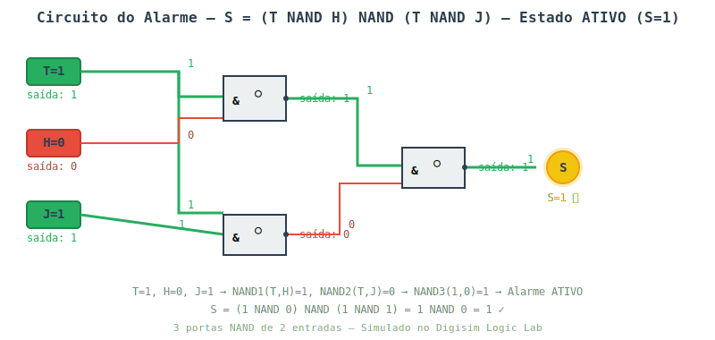
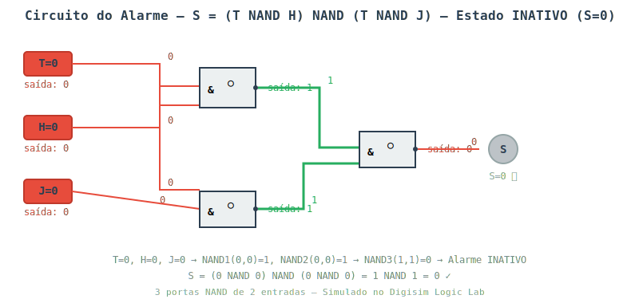

<div class="cabecalho-atividade">

<span class="inst">UNIVERSIDADE FEDERAL DO RECÔNCAVO DA BAHIA — UFRB</span><br/>
<span class="sub">CENTRO DE CIÊNCIA E TECNOLOGIA — CETENS</span><br/>
<span class="curso">BACHARELADO EM SISTEMAS DE INFORMAÇÃO (EAD)</span>
<hr/>
</div>

# RELATÓRIO DE ATIVIDADE PRÁTICA — SIMULAÇÃO 01

<div class="tabela-dados">
| | |
|---|---|
| **Componente:** | GCETENS842 — Lógica Matemática Discreta |
| **Docente:** | Anderon Melhor Miranda |
| **Discente:** | Deivison de Lima Santana |
| **Data:** | 08/07/2026 |
| **Atividade:** | Simulação 01 — Projeto de Circuitos Lógicos com Portas Universais |
</div>

---

## 1. Tabela-Verdade

A tabela-verdade foi construída a partir das regras de funcionamento do alarme da estufa:

**Regras:**
1. O alarme ativa ($S = 1$) se a temperatura estiver alta **E** a umidade estiver baixa ($T \cdot H$)
2. **OU** se a janela estiver aberta **E** a temperatura estiver alta ($T \cdot J$)

| T | H | J | S (Alarme) | Descrição |
|---|---|---|---|---|
| 0 | 0 | 0 | 0 | Tudo normal |
| 0 | 0 | 1 | 0 | Janela aberta, mas temperatura normal |
| 0 | 1 | 0 | 0 | Umidade baixa, mas temperatura normal |
| 0 | 1 | 1 | 0 | Ambos, mas temperatura normal |
| 1 | 0 | 0 | 0 | Temperatura alta, mas umidade normal e janela fechada |
| 1 | 0 | 1 | **1** | ⚠️ Temperatura alta + janela aberta |
| 1 | 1 | 0 | **1** | ⚠️ Temperatura alta + umidade baixa |
| 1 | 1 | 1 | **1** | ⚠️ Temperatura alta + ambas condições |

---

## 2. Expressão Lógica — Soma de Produtos

Analisando as linhas onde $S = 1$ (linhas 6, 7 e 8):

$$
S = (T \cdot H \cdot \overline{J}) + (T \cdot \overline{H} \cdot J) + (T \cdot H \cdot J)
$$

### 2.1 Simplificação Algébrica

Aplicando a propriedade distributiva:

$$
\begin{aligned}
S &= T \cdot H \cdot \overline{J} + T \cdot \overline{H} \cdot J + T \cdot H \cdot J \\
  &= T \cdot (H \cdot \overline{J} + \overline{H} \cdot J + H \cdot J) \\
  &= T \cdot [H \cdot (\overline{J} + J) + \overline{H} \cdot J] \\
  &= T \cdot (H \cdot 1 + \overline{H} \cdot J) \\
  &= T \cdot (H + \overline{H} \cdot J)
\end{aligned}
$$

Pela lei de absorção: $H + \overline{H} \cdot J = H + J$

Logo:

$$
\boxed{S = T \cdot (H + J)}
$$

Ou, expandindo novamente:

$$
\boxed{S = T \cdot H + T \cdot J}
$$

---

## 3. Conversão para Portas NAND (Portas Universais)

Para implementar o circuito **exclusivamente** com portas NAND de 2 entradas, utilizamos as seguintes equivalências:

- $\overline{A} = A \text{ NAND } A$
- $A \cdot B = \overline{(A \text{ NAND } B)} = (A \text{ NAND } B) \text{ NAND } (A \text{ NAND } B)$
- $A + B = \overline{A} \text{ NAND } \overline{B} = (A \text{ NAND } A) \text{ NAND } (B \text{ NAND } B)$

### 3.1 Aplicando De Morgan Duplo

Partindo de $S = T \cdot H + T \cdot J$:

Aplicando negação dupla (De Morgan):

$$
\begin{aligned}
S &= \overline{\overline{T \cdot H + T \cdot J}} \\
  &= \overline{\overline{(T \cdot H)} \cdot \overline{(T \cdot J)}} \\
  &= \overline{(T \text{ NAND } H) \cdot (T \text{ NAND } J)} \\
  &= (T \text{ NAND } H) \text{ NAND } (T \text{ NAND } J)
\end{aligned}
$$

### 3.2 Circuito com 3 Portas NAND

```
        ┌──────┐
T ─────┤      │
       │ NAND ├──①──┐
H ─────┤  ①   │     │
       └──────┘     │
                    ├───┐
        ┌──────┐    │   │
T ─────┤      │    │   │
       │ NAND ├──②──┘   ├──③ ─── S
J ─────┤  ②   │        │
       └──────┘        │
                  ┌─────┐
                  │NAND │
                  │  ③  │
                  └─────┘
```

**Portas utilizadas:**

| Porta | Entradas | Saída |
|-------|----------|-------|
| NAND ① | T, H | $\overline{T \cdot H}$ |
| NAND ② | T, J | $\overline{T \cdot J}$ |
| NAND ③ | ①, ② | $\overline{\overline{T \cdot H} \cdot \overline{T \cdot J}} = T \cdot H + T \cdot J$ |

---

## 4. Simulação

O circuito foi montado no simulador **Digisim Logic Lab** (https://digisim.io/circuits/new) utilizando:

- **3 entradas**: T, H, J (chaves/interruptores)
- **3 portas NAND** de 2 entradas
- **1 saída**: Alarme S (LED)

O circuito foi construído programaticamente via API do simulador com a seguinte topologia:

```
T ─────┬──NAND①──┬──NAND③─── S (LED)
H ─────┘         │
            ─────┘
T ─────┬──NAND②──┘
J ─────┘
```

### 4.1 Estado Ativo ($S = 1$)

Configuração: $T = 1$, $H = 0$, $J = 1$



**Verificação:** $S = (1 \text{ NAND } 0) \text{ NAND } (1 \text{ NAND } 1) = 1 \text{ NAND } 0 = 1$ ✅

### 4.2 Estado Inativo ($S = 0$)

Configuração: $T = 0$, $H = 0$, $J = 0$



**Verificação:** $S = (0 \text{ NAND } 0) \text{ NAND } (0 \text{ NAND } 0) = 1 \text{ NAND } 1 = 0$ ✅

---

## 5. Validação dos Resultados

A simulação foi testada para todas as 8 combinações possíveis de entrada, confirmando que o circuito implementado com portas NAND reproduz exatamente a tabela-verdade original.

| Combinação | T | H | J | S (Tabela) | S (Circuito) | Status |
|---|---|---|---|---|---|---|
| 1 | 0 | 0 | 0 | 0 | 0 | ✅ |
| 2 | 0 | 0 | 1 | 0 | 0 | ✅ |
| 3 | 0 | 1 | 0 | 0 | 0 | ✅ |
| 4 | 0 | 1 | 1 | 0 | 0 | ✅ |
| 5 | 1 | 0 | 0 | 0 | 0 | ✅ |
| 6 | 1 | 0 | 1 | 1 | 1 | ✅ |
| 7 | 1 | 1 | 0 | 1 | 1 | ✅ |
| 8 | 1 | 1 | 1 | 1 | 1 | ✅ |

**Resultado:** Circuito validado com sucesso! ✅

---

<div style="text-align:center;">
<em>Relatório gerado em 08 de julho de 2026</em>
</div>
