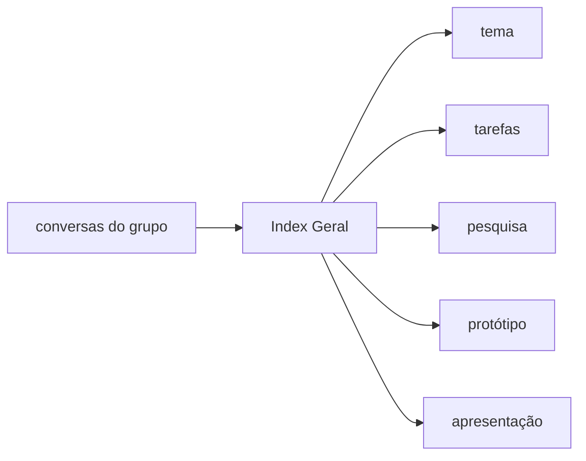

# Index Geral — Core do Grupo

> **Este é o arquivo principal do projeto.**  
> Tudo que for necessário para entender, acompanhar e organizar o trabalho deve passar por aqui.

---

## Visão Rápida do Projeto

---

## 1. Identificação do Projeto

| Campo | Informação |
|---|---|
| **Instituição** | **UFRB — Universidade Federal do Recôncavo da Bahia** |
| **Curso** | **Bacharelado em Sistemas de Informação** |
| **Disciplina** | **GCETENS843 — Projeto Algoritmo I** |
| **Semestre** | **2026.1** |
| **Tipo de trabalho** | Projeto em grupo com proposta de solução computacional para um problema real |
| **Status atual** | Escolha do tema e organização inicial |
| **Data prevista para decidir o tema** | **08/06/2026** |
| **Data de apresentação informada no vídeo** | **29/06/2026 às 20h** |

---

## 2. Como Este Arquivo Deve Funcionar

Este arquivo é o **painel central vivo** do grupo. Ele não é um texto fixo: será atualizado conforme novas conversas, decisões e contribuições surgirem.

Sempre que o projeto avançar, este arquivo deve registrar:

- decisões tomadas;
- temas sugeridos;
- preferências dos integrantes;
- novos documentos criados;
- links importantes;
- tarefas e responsáveis;
- próximos passos;
- dúvidas ainda abertas.

> **Regra prática:** se alguém estiver perdido, deve começar por este arquivo.

---

## 3. Integrantes Confirmados

| Integrante | Participação atual |
|---|---|
| **Deivison de Lima Santana** | Fez a organização inicial, iniciou a documentação e participará ativamente do projeto. Também sugeriu temas ligados à educação, acessibilidade e filas em clínicas/hospitais. |
| **Ausiane** | Sugeriu temas ligados à educação, inclusão, acessibilidade, TEA, deficiência auditiva, baixa visão e dificuldades em plataformas educacionais. |
| **Nubia de Asiká** | Informou que começou a estudar o material e está pensando em sugestões. |
| **Rios** | Participou da organização inicial, perguntou sobre sugestões de problemas e reforçou que o tema é livre, com base no vídeo do professor. |
| **Wallace** | Integrante confirmado; aguardando sugestão própria ou concordância com algum tema já discutido. |

> O professor citou equipes com **8 pessoas**. Se novos integrantes entrarem, esta tabela deve ser atualizada.

---

## 4. O Que Precisa Ser Feito no Projeto

Com base no vídeo do professor, o trabalho precisa apresentar uma solução computacional para um problema real.

O projeto deve conter:

- problema real escolhido;
- pesquisa de soluções ou casos existentes;
- proposta do grupo;
- explicação do diferencial da proposta;
- fluxograma;
- protótipo de telas;
- apresentação final;
- código opcional em **C** ou em outra linguagem.

### Formatos possíveis

Não estamos presos a um único formato de entrega. Conforme a necessidade do grupo, podem existir materiais em vários formatos, por exemplo:

- documentos de texto;
- apresentações;
- imagens;
- protótipos;
- fluxogramas;
- arquivos de código;
- PDFs;
- links externos;
- anotações de reunião;
- materiais de pesquisa.

O importante é que tudo esteja organizado e linkado a partir deste `Index Geral`.

---

## 5. Documentos Existentes

| Nome para leitura | Link | Função |
|---|---|---|
| **Documentação Geral do Projeto** | [`abrir documento`](documentacao-geral-projeto-algoritmos.md) | Reúne requisitos do professor, entregáveis, equipe e ideias amplas. |
| **Temas Sugeridos para Decisão** | [`abrir documento`](temas-sugeridos-decisao-08-06-2026.md) | Organiza as ideias discutidas pelo grupo antes da escolha do tema. |
| **Prints do Vídeo do Professor** | [`abrir pasta`](screenshots/) | Guarda imagens extraídas do vídeo para consulta e apoio visual. |
| **Transcrição do Vídeo do Professor** | [`abrir transcrição`](../../../../../transcricao-video-aa5xv9grsig.md) | Registra o conteúdo falado no vídeo usado como base para entender o trabalho. |

---

## 6. Documentos Planejados

> Esta lista ainda está em aberto. Os documentos planejados podem mudar conforme o grupo decidir o tema, a forma de trabalho e os materiais necessários.

Os links com 🔒 representam documentos que **ainda não existem**, mas já foram previstos para organizar o projeto.

| Status | Nome legível | Local previsto | Para que servirá |
|---|---|---|---|
| 🔒 | **Enquete de Escolha do Tema** | [`enquete-tema-08-06-2026`](enquete-tema-08-06-2026.md) | Registrar votos, preferências e justificativas. |
| 🔒 | **Tema Escolhido pelo Grupo** | [`tema-escolhido`](tema-escolhido.md) | Consolidar o tema final depois da decisão. |
| 🔒 | **Divisão de Tarefas** | [`divisao-de-tarefas`](divisao-de-tarefas.md) | Registrar responsáveis por pesquisa, protótipo, apresentação e possível código. |
| 🔒 | **Casos Existentes e Soluções Semelhantes** | [`casos-existentes`](casos-existentes.md) | Organizar exemplos reais pesquisados na web ou no mercado. |
| 🔒 | **Referências e Links de Pesquisa** | [`referencias-web`](referencias-web.md) | Guardar fontes externas que ajudem na justificativa. |
| 🔒 | **Fluxograma da Solução** | [`fluxograma`](fluxograma.md) | Documentar o fluxo lógico da proposta. |
| 🔒 | **Protótipo de Telas** | [`prototipo-telas`](prototipo-telas.md) | Explicar as telas, ideias visuais e navegação do sistema. |
| 🔒 | **Código ou Simulação em C** | [`codigo-c`](codigo-c/README.md) | Organizar possível implementação, simulação ou explicação do código. |
| 🔒 | **Roteiro da Apresentação** | [`roteiro-apresentacao`](roteiro-apresentacao.md) | Dividir falas, ordem dos assuntos e pontos principais. |
| 🔒 | **Apresentação Final** | [`apresentacao-final`](apresentacao-final.md) | Organizar slides, imagens, texto de apresentação e estrutura final. |
| 🔒 | **Ata de Decisões do Grupo** | [`ata-decisoes`](ata-decisoes.md) | Registrar decisões importantes ao longo do projeto. |
| 🔒 | **Dúvidas para Resolver** | [`duvidas-e-perguntas`](duvidas-e-perguntas.md) | Guardar dúvidas para discutir com o professor ou com o grupo. |

---

## 7. Temas em Discussão

> Estes temas ainda são sugestões. O grupo ainda vai decidir qual caminho seguir.

### 7.1 Educação, Acessibilidade e Inclusão

Tema sugerido a partir das conversas sobre dificuldades de acesso a conteúdos, vídeos, plataformas educacionais, organização de estudos, TEA, deficiência auditiva e baixa visão.

**Ideia central:** criar uma solução que ajude estudantes a se organizarem melhor e/ou acessarem conteúdos educacionais com mais clareza e inclusão.

**Pontos fortes:** próximo da realidade do curso, tem base em vivências do grupo e permite protótipo simples.

---

### 7.2 Filas Inteligentes em Clínicas e Hospitais

Tema sugerido a partir da dificuldade de acompanhar a ordem de atendimento em clínicas e hospitais, especialmente quando os painéis e chamadas não são claros.

**Ideia central:** criar uma solução que torne a fila mais transparente, acessível e acompanhável, inclusive pelo celular.

**Pontos fortes:** problema fácil de explicar, bom para protótipo e excelente para simular com algoritmo de fila.

---

### 7.3 Organização Acadêmica para Estudantes EAD

Tema ligado à baixa participação em aulas, dificuldade de acompanhar trilhas, prazos, vídeos, PDFs e atividades.

**Ideia central:** criar um painel ou organizador simples para estudantes EAD acompanharem progresso, pendências e prioridades.

**Pontos fortes:** pode se juntar ao tema de acessibilidade e ficar bastante conectado à realidade da turma.

---

## 8. Enquete Interna

> A enquete pode ganhar um documento próprio, mas por enquanto a visão geral fica registrada aqui.

| Tema | Preferências já percebidas | Observação |
|---|---|---|
| **Educação + acessibilidade** | Ausiane demonstrou forte interesse; Deivison também tem afinidade com educação. | Tema próximo do curso e das experiências relatadas. |
| **Filas em clínicas/hospitais** | Deivison sugeriu; Ausiane achou interessante. | Tema prático e bom para simulação em C. |
| **Organização acadêmica EAD** | Surgiu a partir da baixa participação nas aulas. | Pode se unir ao tema de educação/acessibilidade. |

**Pergunta principal para 08/06/2026:**  
o grupo prefere seguir pelo caminho de **educação/acessibilidade** ou pelo caminho de **saúde/filas inteligentes**?

---

## 9. Roadmap do Projeto

### Fase 1 — Organização Inicial

| Etapa | Status |
|---|---|
| Criar grupo de comunicação | Concluído |
| Confirmar integrantes iniciais | Concluído |
| Transcrever vídeo do professor | Concluído |
| Criar documentação geral | Concluído |
| Criar arquivo central do grupo | Concluído |

### Fase 2 — Escolha do Tema

| Etapa | Status |
|---|---|
| Listar temas possíveis | Em andamento |
| Ouvir sugestões de todos | Em andamento |
| Fazer enquete ou decisão do tema | Previsto para **08/06/2026** |
| Registrar tema escolhido | Pendente |

### Fase 3 — Pesquisa e Proposta

| Etapa | Status |
|---|---|
| Pesquisar casos existentes | Pendente |
| Definir problema final | Pendente |
| Escrever justificativa | Pendente |
| Definir solução proposta | Pendente |
| Definir diferencial | Pendente |

### Fase 4 — Construção do Material

| Etapa | Status |
|---|---|
| Criar fluxograma | Pendente |
| Criar protótipo de telas | Pendente |
| Decidir se haverá código em C | Pendente |
| Implementar simulação/código, se escolhido | Pendente |

### Fase 5 — Apresentação

| Etapa | Status |
|---|---|
| Criar roteiro de apresentação | Pendente |
| Preparar material visual | Pendente |
| Dividir falas | Pendente |
| Ensaiar apresentação | Pendente |
| Apresentar em **29/06/2026 às 20h** | Pendente |

---

## 10. Como Cada Pessoa Pode Contribuir Agora

| Integrante | Próxima contribuição esperada |
|---|---|
| **Deivison de Lima Santana** | Manter a organização inicial, atualizar este core, participar ativamente da escolha do tema e ajudar na estrutura técnica do projeto. |
| **Ausiane** | Detalhar melhor as ideias ligadas a acessibilidade, TEA, deficiência auditiva e educação. |
| **Nubia de Asiká** | Sugerir tema próprio ou indicar concordância com algum tema já existente. |
| **Rios** | Comentar os temas existentes, sugerir novo tema ou ajudar na escolha final por enquete. |
| **Wallace** | Sugerir tema próprio ou indicar concordância com algum tema já existente. |

---

## 11. Regras de Organização do Repositório

- Este arquivo é o **ponto de partida**.
- Todo documento novo deve ser linkado aqui.
- Decisões importantes devem ser registradas.
- Não publicar telefones, senhas ou dados pessoais desnecessários.
- O repositório é aberto para visualização dos membros, então os textos devem ser claros e respeitosos.
- A estrutura pode mudar conforme o projeto evoluir.

---

## 12. Próxima Decisão Importante

Até **08/06/2026**, o grupo deve decidir:

1. qual tema será escolhido;
2. se haverá código em C ou apenas protótipo/fluxograma;
3. quem ficará responsável por cada parte;
4. quais materiais precisam ser pesquisados;
5. como será organizada a apresentação.

---

## 13. Visão Geral Completa

```mermaid
flowchart TD
    A[Index Geral] --> B[Documentos Existentes]
    A --> C[Documentos Planejados]
    A --> D[Temas em Discussão]
    A --> E[Roadmap]
    A --> F[Contribuições dos Integrantes]

    B --> B1[Documentação Geral]
    B --> B2[Temas Sugeridos]
    B --> B3[Prints do Vídeo]
    B --> B4[Transcrição do Vídeo]

    C --> C1[Enquete]
    C --> C2[Tema Escolhido]
    C --> C3[Divisão de Tarefas]
    C --> C4[Casos Existentes]
    C --> C5[Fluxograma]
    C --> C6[Protótipo]
    C --> C7[Código ou Simulação]
    C --> C8[Apresentação Final]

    D --> D1[Educação + Acessibilidade]
    D --> D2[Filas Inteligentes]
    D --> D3[Organização Acadêmica EAD]

    E --> E1[Escolher Tema - 08/06]
    E --> E2[Pesquisar]
    E --> E3[Propor Solução]
    E --> E4[Criar Materiais]
    E --> E5[Apresentar - 29/06]
```

> Este arquivo continuará sendo atualizado conforme as conversas do grupo avançarem.
