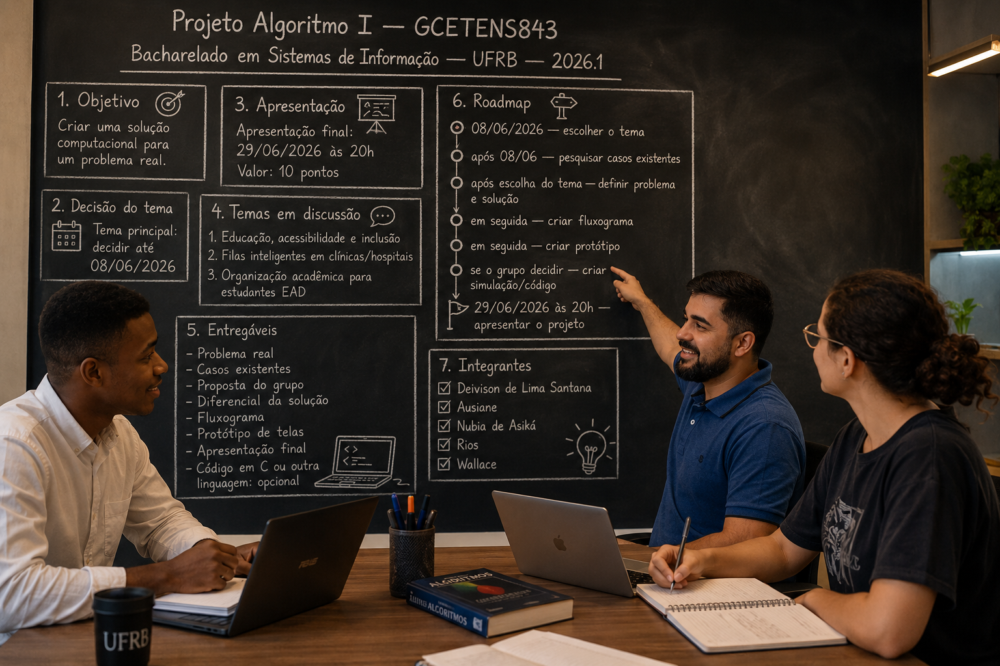

# Index Geral — Projeto Algoritmo I

> **Core do grupo:** este arquivo é o ponto de partida para qualquer pessoa entender o projeto, acompanhar as decisões e encontrar os documentos certos.

---

## 1. Resumo Rápido

> Imagem atual criada para representar os membros ativos do grupo e apoiar a identidade visual do projeto.

| Campo | Informação |
|---|---|
| **Instituição** | **UFRB — Universidade Federal do Recôncavo da Bahia** |
| **Curso** | **Bacharelado em Sistemas de Informação** |
| **Disciplina** | **GCETENS843 — Projeto Algoritmo I** |
| **Semestre** | **2026.1** |
| **Objetivo** | Propor uma solução computacional para um problema real |
| **Decisão do tema** | **08/06/2026** |
| **Apresentação** | **29/06/2026 às 20h** |
| **Situação atual** | Escolhendo o tema e organizando as ideias |

---

## 2. Como Usar Este Core

Este arquivo deve ser atualizado conforme o grupo conversar e tomar decisões.

Ele deve sempre responder rapidamente:

- qual é o projeto;
- quem está no grupo;
- quais temas estão em discussão;
- quais documentos já existem;
- quais documentos ainda serão criados;
- qual é o próximo passo.

> Se alguém novo entrar no grupo, pode começar lendo este arquivo.

---

## 3. Integrantes

O grupo tem **6 integrantes**. Faltam **2 pessoas** para fechar a equipe de 8.

| Nome | Perfil / Contribuição |
|---|---|
| **Deivison de Lima Santana** | Organização, documentação e participação ativa |
| **Ausiane** | TEA + deficiência auditiva unilateral. Trabalhou no NAI. Educação, inclusão, acessibilidade |
| **Nubia de Asiká** | Educação, acessibilidade, diagnósticos tardios |
| **Rios** | Educação, saúde, filas inteligentes, agendamento virtual |
| **Wallace** | Integrante confirmado |
| **Artur Campos** | Entrou em 08/06/2026 |

---

## 4. O Que o Professor Pediu

O trabalho deve apresentar uma proposta de solução computacional para um problema real.

Itens esperados:

- problema real;
- solução proposta pelo grupo;
- casos ou soluções existentes;
- diferencial da proposta;
- fluxograma;
- protótipo de telas;
- apresentação final;
- código em **C** ou outra linguagem, se o grupo decidir fazer.

### Formatos possíveis

O grupo pode organizar materiais em qualquer formato necessário: texto, apresentação, imagem, protótipo, fluxograma, PDF, código, links, anotações ou outros arquivos úteis.

---

## 5. Documentos Existentes

| Documento | Acesso | Para que serve |
|---|---|---|
| **Documentação Geral do Projeto** | [`abrir`](documentacao-geral-projeto-algoritmos.md) | Requisitos do professor, entregáveis e ideias iniciais. |
| **Temas Sugeridos para Decisão** | [`abrir`](temas-sugeridos-decisao-08-06-2026.md) | Ideias discutidas pelo grupo antes da decisão do tema. |
| **Histórico do WhatsApp** | [`abrir`](historico-whatsapp.json) | Todas as conversas do grupo exportadas do WhatsApp. Use para consultar decisões, sugestões e conversas passadas. |
| **Imagens do Grupo e Recortes** | [`abrir pasta`](imagens-grupo/) | Imagens geradas para identidade visual, imagem do grupo ou materiais futuros. |

### Materiais de apoio opcionais

| Material | Acesso | Observação |
|---|---|---|
| **Prints do Vídeo do Professor** | [`abrir pasta`](screenshots/) | Úteis como referência, mas não são leitura obrigatória. |
| **Transcrição do Vídeo do Professor** | [`abrir`](../../../../../transcricao-video-aa5xv9grsig.md) | Apoio técnico para conferir o que foi dito no vídeo. |

---

## 6. Documentos Planejados

> Estes documentos já têm lugar reservado, mas ainda estão pendentes ou incompletos. A lista pode mudar conforme o projeto evoluir.

| Status | Documento | Onde ficará | Objetivo |
|---|---|---|---|
| ✅ Disponível | **Enquete de Escolha do Tema — Google Forms** | [`responder`](https://docs.google.com/forms/d/e/1FAIpQLScjQlJFFuOSHd3z_SyDBF0JI5muF0jVjlGxMedWeO6q4dTTEQ/viewform) | Votar no tema + definir tarefas. Acesse pelo link! |
| 📄 Detalhes | **Estrutura da Enquete** | [`abrir`](enquete-google-forms-link.md) | Documento com todas as perguntas e contexto. |
| 🔒 Pendente | **Tema Escolhido** | [`abrir`](tema-escolhido.md) | Consolidar a decisão final do grupo. |
| 🔒 Pendente | **Divisão de Tarefas** | [`abrir`](divisao-de-tarefas.md) | Organizar responsabilidades. |
| 🔒 Pendente | **Casos Existentes** | [`abrir`](casos-existentes.md) | Guardar exemplos reais e soluções parecidas. |
| 🔒 Pendente | **Referências e Links** | [`abrir`](referencias-web.md) | Guardar fontes de pesquisa. |
| 🔒 Pendente | **Fluxograma** | [`abrir`](fluxograma.md) | Explicar o funcionamento lógico da solução. |
| 🔒 Pendente | **Protótipo de Telas** | [`abrir`](prototipo-telas.md) | Organizar as telas e ideias visuais. |
| 🔒 Pendente | **Código ou Simulação em C** | [`abrir`](codigo-c/README.md) | Guardar possível implementação ou explicação técnica. |
| 🔒 Pendente | **Roteiro da Apresentação** | [`abrir`](roteiro-apresentacao.md) | Dividir falas e ordem dos assuntos. |
| 🔒 Pendente | **Apresentação Final** | [`abrir`](apresentacao-final.md) | Organizar material final da apresentação. |
| 🔒 Pendente | **Ata de Decisões** | [`abrir`](ata-decisoes.md) | Registrar decisões importantes. |
| 🔒 Pendente | **Dúvidas e Perguntas** | [`abrir`](duvidas-e-perguntas.md) | Guardar dúvidas para o grupo/professor. |

---

## 7. Temas em Discussão

> Ainda são sugestões. O grupo vai decidir o tema em **08/06/2026**.

### 7.1 Educação, Acessibilidade e Inclusão

Ideia ligada a estudantes EAD, plataformas, acesso a conteúdo, organização de estudos, TEA, deficiência auditiva e baixa visão.

Também surgiu a observação de que muitas pessoas recebem diagnósticos tardios, especialmente em questões relacionadas a neurodivergências e acessibilidade. Se essas necessidades tivessem sido percebidas e acolhidas antes, muitos obstáculos, frustrações e traumas educacionais poderiam ter sido evitados. Isso fortalece a ideia de pensar em uma solução que ajude a identificar necessidades, organizar apoio e tornar o ambiente educacional mais inclusivo.

**Ausiane** (que tem TEA e deficiência auditiva unilateral) pode contribuir com vivência real sobre acessibilidade em plataformas e acolhimento.

### 7.2 Filas Inteligentes em Clínicas e Hospitais (+ Acessibilidade)

Ideia ligada a melhorar a transparência de filas, chamadas, painéis e acompanhamento pelo celular.

**Contribuição do Rios:** sugeriu um sistema de agendamento por horário com fichas virtuais, onde o paciente é atendido no horário agendado sem precisar pegar fila. A solução poderia funcionar tanto na rede pública (SUS) quanto privada, e não se limitaria apenas a clínicas — poderia ser aplicada em qualquer organização que precise gerenciar filas de atendimento. O objetivo é reduzir o desconforto da espera e da fila.

**Ausiane** sugeriu incluir acessibilidade no sistema de filas, já que muitos sistemas não têm suporte para pessoas com deficiência auditiva, baixa visão ou TEA. **Rios concordou** com a inclusão de acessibilidade.

> 📌 **Tendência atual:** o grupo parece estar convergindo para **Filas Inteligentes + Acessibilidade**, combinando os dois temas. Ausiane e Rios já demonstraram apoio a essa abordagem.

### 7.3 Organização Acadêmica para Estudantes EAD

Ideia ligada a prazos, trilhas, materiais, progresso e participação em aulas.

---

## 8. Enquete — Google Forms

A enquete oficial do grupo está no **Google Forms**:

> 🔗 **[Responder agora](https://docs.google.com/forms/d/e/1FAIpQLScjQlJFFuOSHd3z_SyDBF0JI5muF0jVjlGxMedWeO6q4dTTEQ/viewform)**

A enquete contém:
- **Pergunta 1:** Votação do tema (4 opções)
- **Pergunta 2:** Concordância com acessibilidade nas filas
- **Perguntas 3 a 10:** Nível de envolvimento em cada tarefa (liderar/ajudar/não atuar)
- **Pergunta 11:** Melhor horário para reuniões
- **Pergunta 12:** Comentários adicionais

📄 **[Ver estrutura completa da enquete](enquete-google-forms-link.md)**

> 📊 **Preferências percebidas no WhatsApp:** Ausiane disse "Topo esse, tbm" para filas inteligentes e Rios reforçou o apoio. O grupo parece estar convergindo para **Filas Inteligentes + Acessibilidade** como tema combinado.

---

## 9. Roadmap

| Fase | O que precisa acontecer | Status |
|---|---|---|
| 1 | Organizar grupo, vídeo, documentação inicial e core | Concluído |
| 2 | Decidir o tema | Em andamento — até **08/06/2026** (grupo convergindo para **Filas Inteligentes + Acessibilidade**) |
| 3 | Pesquisar casos existentes e definir problema final | Pendente |
| 4 | Criar fluxograma, protótipo e possível código | Pendente |
| 5 | Preparar e apresentar o trabalho | Pendente — **29/06/2026 às 20h** |

---

## 10. Como Cada Pessoa Pode Contribuir Agora

| Integrante | Próxima contribuição esperada |
|---|---|
| **Deivison de Lima Santana** | Manter o core atualizado, organizar documentos e finalizar a definição do tema com o grupo |
| **Ausiane** | Detalhar requisitos de acessibilidade para o protótipo |
| **Nubia de Asiká** | Aguardando posicionamento sobre o tema final |
| **Rios** | Aprofundar o tema de filas inteligentes e sugerir ajustes |
| **Wallace** | Indicar concordância com o tema escolhido |
| **Artur Campos** | Se apresentar e dar sugestões |

---

## 11. Regras Simples

- Este arquivo é o ponto de partida.
- Todo documento novo deve ser linkado aqui.
- Não publicar telefones, senhas ou dados pessoais desnecessários.
- As informações podem mudar conforme o grupo decidir novas coisas.
- O texto deve ser claro para qualquer integrante entender sem conhecimento técnico.

---

## 12. Contagem do Grupo

| Situação | Quantidade |
|---|---|
| Integrantes ativos | 6 |
| **Vagas restantes** | **2** (para fechar 8) |

## 13. Próximo Passo

**Hoje é 08/06/2026** — a **[enquete está no ar!](https://docs.google.com/forms/d/e/1FAIpQLScjQlJFFuOSHd3z_SyDBF0JI5muF0jVjlGxMedWeO6q4dTTEQ/viewform)** Compartilhe com o grupo para votarem.

Depois da votação, o core será atualizado com:

- tema escolhido (baseado na enquete);
- divisão de tarefas (baseada na enquete);
- justificativa;
- próximos documentos;
- caminho da apresentação.
