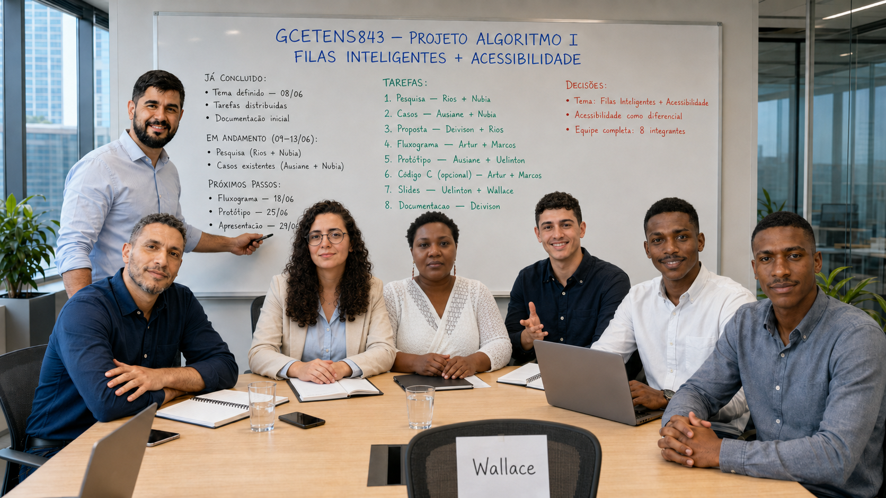

# Index Geral — Projeto Algoritmo I

> **Core do grupo:** este arquivo é o ponto de partida. Ele foi fixado no grupo do WhatsApp para que qualquer integrante entenda rapidamente o projeto, encontre os documentos certos e saiba o que já foi feito e o que ainda precisa ser entregue.

---

> *Imagem atual do grupo com Deivison, Ausiane, Rios, Artur, Uelinton, Nubia e Marcos Vinicius. Wallace ainda não mandou imagem para entrar aqui — bora enviar, Wallace 😅*

---

## 1. Resumo do Projeto

| Campo | Informação |
|:------|:-----------|
| **Instituição** | UFRB — Universidade Federal do Recôncavo da Bahia |
| **Curso** | Bacharelado em Sistemas de Informação (EAD) |
| **Disciplina** | GCETENS843 — Projeto Algoritmo I |
| **Semestre** | 2026.1 |
| **Tema escolhido** | Filas Inteligentes em Serviços de Saúde com Foco em Acessibilidade |
| **Apresentação final** | **29/06/2026 às 20h (AO VIVO)** |

> 📄 [Documento completo do tema](tema-escolhido.md) · [Divisão de tarefas](divisao-de-tarefas.md) · [Decisões do projeto](decisoes.md)

---

## 2. Integrantes e Tarefas

A equipe está completa com **8 integrantes**. Cada um com suas responsabilidades:

- **🧠 Deivison** — Proposta + Documentação (organização do repositório)
- **🏥 Rios** — Pesquisa + Proposta (experiência em saúde)
- **♿ Ausiane** — Casos Existentes + Protótipo (acessibilidade e design)
- **📚 Nubia** — Pesquisa + Casos Existentes (inclusão e diagnósticos tardios)
- **📊 Artur** — Fluxograma + Código C (perfil técnico)
- **🆕 Marcos Vinicius** — Fluxograma + Código C (se voluntariou)
- **🎤 Uelinton** — Protótipo + Slides (engajado e disponível)
- **👤 Wallace** — Slides (apoio)

> 📋 [Ver divisão de tarefas completa com justificativas](divisao-de-tarefas.md)

---

## 3. O Que o Professor Pediu

| Item | Obrigatório? | Prazo |
|:-----|:------------:|:-----:|
| Problema real definido | ✅ Sim | 29/06 |
| Casos existentes (mercado) | ✅ Sim | 29/06 |
| Proposta/solução inovadora | ✅ Sim | 29/06 |
| Fluxograma do sistema | ✅ Sim | 29/06 |
| Protótipo de telas (mockups) | ✅ Sim | 29/06 |
| Apresentação AO VIVO | ✅ Sim | **29/06 às 20h** |
| Código em C | ❌ Opcional | A decidir |

> 📄 [Documentação geral com detalhes](documentacao-geral-projeto-algoritmos.md)

---

## 4. Roadmap — O Que Já Fizemos e o Que Falta

### ✅ Já concluído

| Etapa | Documento | Responsável |
|:------|:----------|:-----------:|
| Tema escolhido | [`tema-escolhido.md`](tema-escolhido.md) | Deivison |
| Tarefas distribuídas | [`divisao-de-tarefas.md`](divisao-de-tarefas.md) | Deivison |
| Decisões registradas | [`decisoes.md`](decisoes.md) | Deivison |
| Histórico do WhatsApp | [`historico-whatsapp.json`](historico-whatsapp.json) | Deivison |

### 🔄 Em andamento (09–13/jun)

| O quê | Responsáveis | Prazo | Arquivo |
|:------|:-------------|:-----:|:--------|
| Pesquisar o problema real | Rios + Nubia | 13/06 | `casos-existentes.md` |
| Levantar referências | Nubia + Rios | 13/06 | `referencias-web.md` |

### 🔒 Pendente

| O quê | Responsáveis | Prazo | Arquivo |
|:------|:-------------|:-----:|:--------|
| Proposta e diferencial | Deivison + Rios | 18/06 | — |
| Fluxograma do sistema | Artur + Marcos | 18/06 | [`fluxograma.md`](fluxograma.md) |
| Protótipo de telas (Figma) | Ausiane + Uelinton | 25/06 | [`prototipo-telas.md`](prototipo-telas.md) |
| Código em C (a confirmar) | Artur + Marcos | 25/06 | [`codigo-c/README.md`](codigo-c/README.md) |
| Slides da apresentação | Uelinton + Wallace | 28/06 | — |
| Roteiro de apresentação | Uelinton + Wallace | 28/06 | [`roteiro-apresentacao.md`](roteiro-apresentacao.md) |

### 🗓️ Data final

> **🎤 Apresentação AO VIVO — 29 de junho de 2026 às 20h**

---

## 5. Como Usar Este Repositório

Cada integrante deve:

1. **Ler este Index** — ele é a porta de entrada para tudo
2. **Conferir sua tarefa** na [divisão de tarefas](divisao-de-tarefas.md)
3. **Produzir o material** da sua área
4. **Enviar para o Deivison** no WhatsApp — ele fará o upload no GitHub
5. **Acompanhar os prazos** no roadmap acima

### Links rápidos

| O que procura? | Clique aqui |
|:---------------|:------------|
| Tema completo e história da decisão | [`tema-escolhido.md`](tema-escolhido.md) |
| Quem faz o quê (com justificativas) | [`divisao-de-tarefas.md`](divisao-de-tarefas.md) |
| Decisões e checklist do projeto | [`decisoes.md`](decisoes.md) |
| Histórico completo do WhatsApp | [`historico-whatsapp.json`](historico-whatsapp.json) |
| Documentação geral (requisitos do professor) | [`documentacao-geral-projeto-algoritmos.md`](documentacao-geral-projeto-algoritmos.md) |
| Imagens do grupo | [`imagens-grupo/`](imagens-grupo/) |

### Regras

- 📌 **Este link está fixado no grupo do WhatsApp** — todo mundo tem acesso
- 📁 Todo novo documento deve ser linkado aqui
- 🔒 Não publique telefones, senhas ou dados pessoais no repositório
- 💬 Dúvidas? Pergunte no grupo do WhatsApp

---

## 6. Próximo Passo

**Estamos na fase de PESQUISA (09 a 13/06).** O foco agora é:

| Quem | O que fazer |
|:-----|:------------|
| **Rios + Nubia** | Pesquisar o problema real: dados sobre filas em saúde, artigos, notícias |
| **Ausiane + Nubia** | Levantar casos existentes: sistemas parecidos, soluções do mercado |
| **Deivison** | Preparar a proposta com base no que for levantado |
| **Demais** | Aguardar a próxima fase (14/06) para começar fluxograma e protótipo |

> ⚠️ **Código em C:** ainda não foi decidido se será implementado. O grupo vai confirmar nas próximas conversas.

---

*Este arquivo é atualizado conforme o grupo avança. Fique de olho no WhatsApp para novas instruções.*
