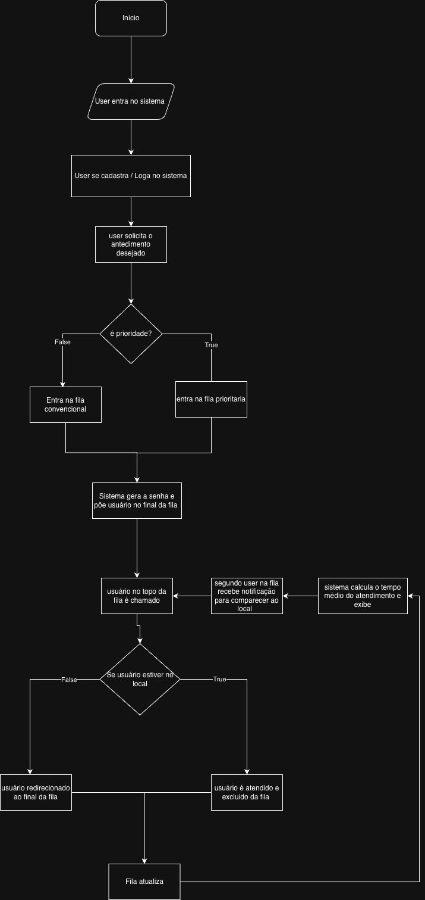

# Fluxograma do Sistema — FilaClara

> **Status:** ✅ Finalizado
> **Arquivo:** [`assets/fluxograma.jpeg`](assets/fluxograma.jpeg)
> **Data:** 25/06/2026

---

## 📊 Visão Geral do Fluxo

O fluxograma descreve o percurso completo do usuário no sistema FilaClara,
desde a entrada até o atendimento, incluindo a lógica de prioridade e
notificação.

```
┌─────────────────────────────┐
│           INÍCIO            │
└─────────────┬───────────────┘
              ▼
┌─────────────────────────────┐
│   User entra no sistema     │
└─────────────┬───────────────┘
              ▼
┌─────────────────────────────┐
│ User se cadastra / Loga     │
│      no sistema             │
└─────────────┬───────────────┘
              ▼
┌─────────────────────────────┐
│ User solicita atendimento   │
│       desejado              │
└─────────────┬───────────────┘
              ▼
       ┌──────────────┐
       │ É prioridade?│
       └──┬───────┬───┘
          │       │
        Sim       Não
          │       │
          ▼       ▼
  ┌──────────┐ ┌──────────┐
  │Fila      │ │Fila      │
  │Prioritária│ │Convencio-│
  │          │ │nal       │
  └────┬─────┘ └────┬─────┘
       │            │
       └──────┬─────┘
              ▼
┌─────────────────────────────┐
│  Sistema gera a senha e     │
│  põe user no final da fila  │
└─────────────┬───────────────┘
              ▼
┌─────────────────────────────┐
│  User no topo da fila       │
│       é chamado             │
└─────────────┬───────────────┘
              ▼
┌─────────────────────────────┐
│  2º user na fila recebe     │
│  notificação p/ comparecer  │
└─────────────┬───────────────┘
              ▼
┌─────────────────────────────┐
│  Sistema calcula tempo      │
│  médio de atendimento e     │
│         exibe               │
└─────────────┬───────────────┘
              ▼
┌─────────────────────────────┐
│  User é atendido e          │
│  excluído da fila           │
└─────────────┬───────────────┘
              ▼
┌─────────────────────────────┐
│      Fila atualiza          │
└─────────────┬───────────────┘
              ▼
              FIM
```

---

## 🔍 Detalhamento de Cada Etapa

### 1. Entrada no Sistema
- Usuário acessa o aplicativo (web ou mobile)
- Se já tem cadastro → faz login
- Se não tem → realiza cadastro rápido

### 2. Solicitação de Atendimento
- Usuário escolhe a clínica/unidade
- Seleciona o tipo de atendimento (consulta comum, exame, prioritário, retorno, triagem)

### 3. Decisão: É Prioridade? ⚖️
- **Sim** → direcionado para **fila prioritária** (idosos, gestantes, PcD, TEA, prioridades legais)
- **Não** → direcionado para **fila convencional**
- Ambas as filas seguem o mesmo fluxo a partir daqui

### 4. Geração de Senha
- Sistema gera senha única (ex: `A-028`)
- Registra horário de entrada
- Posiciona usuário no final da fila correspondente
- Calcula previsão inicial de atendimento

### 5. Chamada e Notificação
- **Quando o usuário atinge o topo da fila** → é chamado para atendimento
- **Notificação antecipada:** o 2º usuário na fila recebe aviso para se dirigir ao local
- Sistema exibe o tempo médio de atendimento em tempo real

### 6. Atendimento e Finalização
- Usuário é atendido
- Sistema o exclui da fila
- Fila é atualizada automaticamente
- Próximo usuário no topo é chamado

---

## 🖼️ Fluxograma Original



> Fluxograma criado originalmente por **Artur + Marcos Vinicius**, refatorado e documentado em 25/06/2026.

---

## 📋 Checklist de Implementação

- [x] Entrada do paciente (cadastro/login)
- [x] Tipo de fila (comum vs prioritária)
- [x] Algoritmo de chamada (ordem + prioridade)
- [x] Notificação ao paciente (antecipada para 2º da fila)
- [x] Painel de acompanhamento
- [x] Cálculo de tempo médio
- [x] Atualização automática da fila

---

> 🔗 [Voltar ao Index Geral](Index-Geral.md)
